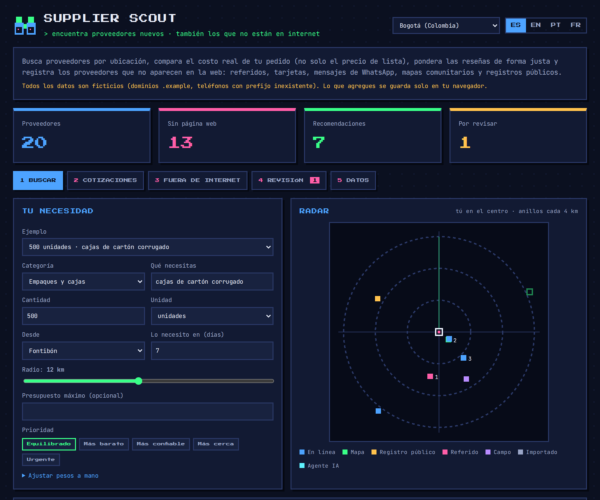
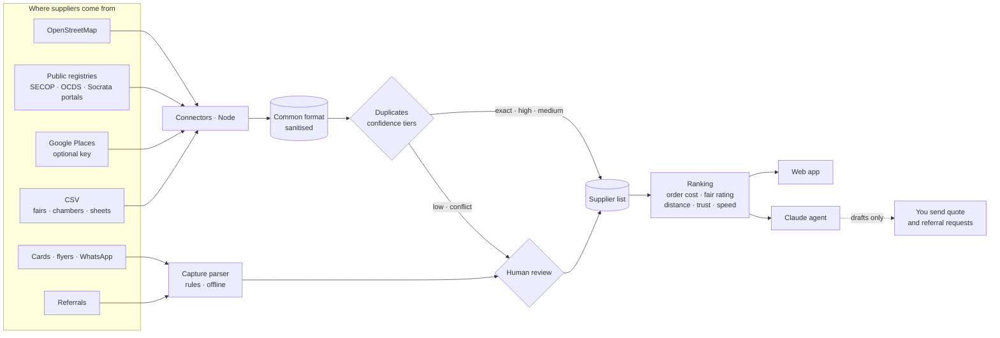

<div align="center">

# 🔭 Supplier Scout

**Find new suppliers — including the ones that are not online — and compare them by what your order really costs.**<br>
Location · real order cost · fair ratings · trust from referrals · human review · optional Claude agent.

[](https://github.com/Dsergio909/supplier-scout/actions/workflows/ci.yml)


[**▶ Live demo**](https://dsergio909.github.io/supplier-scout/) · [🇪🇸 Resumen en español](#-resumen-en-español) · [Playbook: suppliers that are not online](docs/offline-playbook.md) · [Countries and languages](docs/countries.md)



</div>

## The problem

Finding a new supplier usually means a web search, a spreadsheet and a few phone calls. Three things go wrong:

1. **The best suppliers are often not on the web.** Small workshops, family businesses and distributors who sell by phone or WhatsApp have no website. A colleague knows them, a current supplier buys from them, or they are in a public registry or on a community map. Web search never shows them.
2. **The cheapest list price is rarely the cheapest order.** Pack sizes, minimum orders, tax, shipping and payment terms change the total. A $2,100 box with a 1,000-unit minimum and 10-day delivery loses to a $2,600 box delivered in 2 days.
3. **Star ratings mislead.** A 5.0 from 2 reviews beats a 4.7 from 300, and a supplier with no online reviews looks worse than one with bad reviews.

## What it does

1. **Searches by location.** Distance from your delivery point, a search radius, and suppliers that deliver are kept even when they are far.
2. **Compares the real cost of your order.** Every quote becomes whole packs, the minimum order, tax, shipping, your currency (at a rate you set) and, optionally, the value of paying later.
3. **Rates fairly.** A Bayesian average of online reviews and your own team's reviews. No reviews means "unknown", not "bad".
4. **Finds and records offline suppliers.** Community maps and public registries (connectors), fair and chamber-of-commerce lists (CSV), business cards and WhatsApp messages (a parser that runs in the browser), and referrals from people you trust.
5. **Keeps a human in the loop.** New captures and ambiguous duplicates go to a review queue. Quote requests and referral requests are drafted for you to send; nothing is sent automatically.
6. **Explains every position.** Each result says why: order total, adjusted rating, distance, trust, lead time, and warnings (no quote yet, misses the deadline, over budget, unverified).
7. **Optional Claude agent.** Describe what you need in plain language; the agent searches your list, the map and the registry, ranks the candidates and drafts the messages.
8. **Works across Latin America and beyond.** Spanish-speaking Latin America, Brazil, Spain, Portugal, France and the US have country profiles, and the whole app speaks Spanish, English, Portuguese and French. [Details](docs/countries.md).

## Finding suppliers that are not online

This is the core of the project. The full guide is in the [playbook](docs/offline-playbook.md).

| Channel | How Supplier Scout helps |
|---|---|
| Referrals from current suppliers and colleagues | Drafts the "who do you buy this from?" message; records who recommended whom; counts only independent referrals toward trust |
| Public registries (procurement, chambers of commerce) | SECOP II connector for Colombia; an OCDS connector for every government that publishes open contracting data; any Socrata open-data portal; CSV import for any other registry. The app lists each country's procurement portal and business registry |
| Community maps | OpenStreetMap connector for any country, reporting how many results have no website |
| Trade districts and fairs | CSV import that recognises columns by name in Spanish, English, Portuguese and French |
| Business cards, flyers, WhatsApp | Rule-based parser: name, tax ID with check digit, phones, emails, handles, address, prices, pack size, minimum order, lead time, payment terms |
| Verification | Tax-ID check digits, verification levels (contacted → formal → visited → bought from), human review queue |

## How the ranking works

| Factor | What it measures | When data is missing |
|---|---|---|
| Price | Total cost of *your* order (packs, minimum, tax, shipping, currency, payment term) relative to the cheapest option | Neutral + "ask for a quote" |
| Rating | Bayesian blend: a neutral prior worth 5 reviews, online reviews (capped at 100), team reviews ×3 | Neutral |
| Distance | Inside your radius; suppliers that deliver keep a floor | Neutral |
| Trust | Verification level + independent referrals (self and same-group referrals ignored, mutual ones count half) | Lowest level |
| Speed | Lead time; a hard warning if it misses your deadline | Neutral |

Weights are presets (balanced, cheapest, most reliable, nearest, urgent) or sliders.

## Countries and languages

Built in Colombia, meant for Latin America, usable anywhere. The full table is in [docs/countries.md](docs/countries.md).

- **23 country profiles + a generic one:** the 17 Spanish-speaking countries of Latin America from Mexico to Argentina (Cuba uses the generic profile), plus Puerto Rico, Brazil, Spain, Portugal, France and the US. Each one knows its currency, its sales tax name and default rate (IVA, IGV, ITBIS, ITBMS, ISV, IVU, TVA), its tax ID, its phone habits and where formal suppliers are listed (procurement portal, business registry, data-protection law).
- **Tax-ID check digits in 13 countries**, including Brazil's alphanumeric CNPJ (from July 2026). Where no public check-digit rule exists (Mexico's RFC, Venezuela's RIF, most of Central America), the ID is checked for format and the app says "format only" instead of "valid".
- **How suppliers actually write:** Argentina's "15" mobiles, Mexico's old "044", RD$, quetzales, colones, guaraníes, "+ IGV", "com impostos", "HT", an *arroba* (12.5 kg in Colombia, 15 kg in Brazil), *tlapalería* or *ferragens*, and addresses by landmark ("100 varas al sur").
- **Four languages:** the web app, the explanation of every ranking, the quote and referral requests (which name the local tax: "¿incluye IGV?") and the agent. The app follows the browser's language.
- **Sample data** for Bogotá, Mexico City and São Paulo.

## Design decisions

- **Missing data is neutral, never zero.** This is what lets an offline supplier with no reviews and no quote yet compete with a web shop, while still showing what to ask for.
- **Precision over recall for duplicates.** Same tax ID, phone, email or corporate domain merges automatically; a similar name alone always goes to a person. Two different valid tax IDs are never merged, even with a shared phone.
- **The agent cannot invent suppliers.** The output file contains only suppliers a tool returned. Whatever the model writes is used for the summary and the drafts, not as data.
- **One logic, three front ends.** `src/core` is plain JavaScript with no dependencies. The browser demo, the CLI and the agent run the same code, and the tests cover it.
- **Country-agnostic by configuration.** A country is one profile: currency, default sales tax, tax-ID rules, phone habits and local weights. Adding one touches no other file. Local details are respected: a "libra" in a Colombian market is 500 g, and a regional unit always asks for confirmation.
- **Honest validation.** A tax ID is "valid" only when a check digit proves it; otherwise the app says "format only". A label shared by several countries ("RUC" is used in five) switches country only on a verified check digit, never on a guess.
- **No AI where rules are enough.** Card and WhatsApp parsing is rule-based, runs offline and is predictable. The model is used only where it adds something: planning a search from a plain-language request.

## The AI agent

`agent/` uses the Claude API (official `@anthropic-ai/sdk`, model `claude-opus-5-5` by default) with seven read-only tools: `find_coordinates`, `search_my_database`, `search_map`, `search_public_registry` (Colombia), `search_google_places` (only if you set a key), `rank_candidates` and `draft_messages`.

- **It only reads and drafts.** There is no tool to send messages, write files or browse arbitrary pages. You review and send.
- **Data minimisation.** Phone numbers and emails never go to the model; WhatsApp links for the drafts are filled in locally. Suppliers who refused consent for their personal data are ranked locally but never described to the model.
- **Cost control.** At most 12 steps per run, effort `medium`, prompt caching, and token usage printed at the end.
- **Safety.** Tool results are treated as data, not instructions (a business name on a map could contain text meant to manipulate the model). If a safety classifier declines a request, the API's server-side fallback retries on its recommended model (`fallbacks: "default"`).
- **`--dry-run`** runs the same tools in a fixed order without AI or a key, to try it or compare.
- **Language:** `--lang es|en|pt|fr`; by default, the language of the country (`--country BR` answers in Portuguese).

## Security

| Risk | Mitigation |
|---|---|
| AI invents suppliers, prices or reviews | Candidates come only from tool results; the loop is tested with a scripted model that tries to invent one |
| Prompt injection through third-party data (names, notes) | Tools are read-only; no send or write tools; the system prompt marks tool output as data; a person sends every message |
| Personal data sent to the AI provider | Tool results strip phones and emails (tested) |
| API keys leaking | Keys only in environment variables (`.env` is git-ignored, `.env.example` is empty); the Places key goes in a header, never the URL (tested) |
| Query injection (Overpass QL, SoQL) | User text is reduced to letters and digits before building map queries; SoQL string literals are escaped (tested) |
| Malicious import file (XSS, `javascript:` links, huge files) | One sanitising gate for all external data (also applied to what the browser saved, since storage is shared by every page on the same GitHub Pages domain); http(s) links only; 2 MB limit; the page renders with `textContent` only |
| Huge or hostile inputs (availability) | Capture text capped at 5,000 characters and tested against regex backtracking; imports capped at 2,000 suppliers; duplicate search and ranking tested to stay fast at those limits; connector responses capped at 5 MB while streaming |
| Spreadsheet formula injection in the CSV export | Cells starting with `=`, `+`, `-`, `@` are exported as text (tested) |
| Demo page | Strict CSP with no third-party origins at all: scripts, styles and fonts (self-hosted, SIL Open Font License) come from the site itself, and `connect-src 'none'` means the page makes no network requests. No cookies or trackers |
| Personal data of sole traders (Colombia: Law 1581 of 2012; LGPD in Brazil and similar laws across the region) | Consent checkbox on capture that names the selected country's law, warning in the ranking when consent was refused, never sent to the AI agent when refused, data stays in the browser unless exported. The OCDS connector imports the business, never the contact person's name (tested) |
| Leaking real data from this public repo | All data is fictional: `.example` domains, phones in unassigned ranges (Colombia `999`, Mexico `55 0000`, Brazil `(11) 0000`, or ranges reserved for fiction), tax IDs generated with a correct check digit. Tests enforce it |
| CI supply chain | Read-only permissions, no persisted credentials, `npm ci --ignore-scripts`, one runtime dependency (the official SDK, used only by the agent), Dependabot for security updates |
| Terms of the data sources | OSM and Nominatim: attribution and an identifying User-Agent, geocoding only when you give a place name; Google Places: records are flagged for refresh or deletion per Google's terms |

## Architecture



## Project structure

```
src/core/          shared logic, no dependencies (browser + Node)
  countries.js       23 country profiles: currency, tax, tax-ID check digits, phone habits, registries
  capture.js         business card / flyer / WhatsApp text -> draft supplier
  quotes.js          units, packs, minimum order, tax, shipping, FX, payment terms
  reviews.js         Bayesian rating blend
  trust.js           verification levels and referral counting
  dedupe.js          duplicate detection with confidence tiers, merging
  score.js           explainable ranking
  csv.js · schema.js import/export and the sanitising gate
  messages.js        explanations (ES / EN / PT / FR) · outreach.js quote & referral drafts
src/connectors/    OpenStreetMap, Socrata/SECOP, OCDS, Google Places, Nominatim (Node)
src/data/          fictional demo data (Bogotá, Mexico City and São Paulo)
cli/scout.js       connectors, CSV import, merge and rank from the terminal (args.js: shared parser)
agent/             Claude agent: tools, loop, system prompt, CLI
demo/              the web app (GitHub Pages): app.js, i18n.js (ES/EN/PT/FR texts), self-hosted fonts
tests/             150 tests: core, regional formats, connectors against API-shaped fixtures,
                   CLI, agent loop with a scripted model, demo security guards
docs/              screenshots, the offline playbook and the country coverage table
```

## Run it

Requires Node 22+.

```bash
npm test                 # the whole suite, no network and no API key needed
```

**Web app:** open [the live demo](https://dsergio909.github.io/supplier-scout/), or serve the repository locally (for example `npx http-server .`) and open `/demo/`.

**Connectors (no AI):** each command writes a JSON file you import in the web app (tab *Data*).

```bash
npm install
npm run scout -- osm --category packaging --lat 4.6782 --lng -74.1411 --radius 3000 --out data/map.json
npm run scout -- registry --preset secop-co --describe          # show the dataset's columns and how they were mapped
npm run scout -- registry --preset secop-co --q "carton corrugado" --city Bogota --out data/secop.json
npm run scout -- registry --domain https://data.example.gov --dataset abcd-1234 --country XX --q "..."   # any Socrata portal
npm run scout -- ocds --file releases.json --country PY --q "carton" --out data/ocds.json   # any OCDS publisher (or --url https://...)
npm run scout -- csv --file exhibitors.csv --country CO --out data/fair.json
npm run scout -- merge data/map.json data/secop.json data/fair.json --out data/all.json
npm run scout -- rank --db data/all.json --category packaging --qty 500 --lat 4.6782 --lng -74.1411 --radius 12 --days 7
```

**Agent:**

```bash
cp .env.example .env     # put your ANTHROPIC_API_KEY in .env (never in code)
node --env-file=.env agent/cli.js "Necesito 500 cajas de cartón corrugado cerca de Fontibón, Bogotá, en 7 días" \
     --db data/all.json --out data/result.json

# Without AI or a key: the same tools in a fixed order
npm run agent -- --dry-run --db data/all.json --category packaging --qty 500 --lat 4.6782 --lng -74.1411 --days 7
```

`data/` is git-ignored so your real supplier lists never end up in the repository.

## What is tested, and what is not

Being explicit, because this matters more than the feature list:

- **Tested (150 automated tests in CI):** all core logic; every country profile; check digits with fictional numbers that pass and fail; cards and WhatsApp messages written the way suppliers write in Mexico, the Dominican Republic, Brazil, Ecuador, Chile, Peru, Costa Rica and France; the connectors against fictional fixtures shaped like each API's documented responses (OCDS included); the CLI end to end; the agent loop against a scripted stand-in for the Claude API (tool calls, parallel results, errors, refusals, step limit, append-only history, no invented suppliers, no phones sent to the model); that every interface text exists in the four languages; the demo's CSP and rendering guards; speed at the import limits. The web app was checked in Chromium in the four languages, on desktop and on a 375 px phone viewport.
- **Checked against official sources, not against live systems:** the check-digit algorithms were compared with examples published by each tax authority (those real numbers are not kept in the repository). Tax rates, portal names and law names are as of 2026 and are editable defaults, not tax or legal advice.
- **Not yet run against the live services:** the development environment could not reach OpenStreetMap, datos.gov.co, OCDS publishers, Google or the Claude API. The request formats follow each service's documentation, but the first real run may need small adjustments. The SECOP connector reads the dataset's columns at run time (`--describe` shows the mapping) precisely because I could not verify their names.
- **Known limits:** GitHub Pages cannot send security headers, so the CSP is a `<meta>` tag and cannot forbid framing (the page has no sensitive actions to hijack); distance is a straight line, not travel time; tax rates are editable defaults and import duties are not included; the capture parser handles common formats and anything unusual needs a manual fix, which is why every capture goes to review.

## Roadmap

- **Supplier self-registration:** a QR code at a fair booth linking to a Google Form, imported through the same CSV path (an Apps Script adapter, as in [Supplier Radar](https://github.com/Dsergio909/supplier-radar)).
- **Photo of a business card:** OCR (a local model such as Qwen, or Claude vision) feeding the same rule-based parser.
- **WhatsApp inbox to review queue** with an n8n flow.
- Run the agent with a local model for zero API cost.
- Travel time instead of straight-line distance; landed cost for imports (duties, freight).
- An agent tool for OCDS publishers; check digits for Mexico's RFC homoclave and Venezuela's RIF.

## About

Built by **Sergio García**, an International Business student in Bogotá who likes turning repetitive work into automated systems. I don't come from engineering: I learn by building, using generative AI as a pair programmer. I had sketched a first version of this idea while working in purchasing, but never kept it. This repository is a rebuild from scratch, written with Claude Code; the design choices (neutral scoring for missing data, human review, drafts instead of automatic messages) come from how purchasing actually works.

Companion project: [Supplier Radar](https://github.com/Dsergio909/supplier-radar) keeps track of the suppliers you already have; Supplier Scout finds new ones.

[LinkedIn](https://linkedin.com/in/sergio-david-garcia-celis-836b8a250) · [dsergio909@gmail.com](mailto:dsergio909@gmail.com)

---

## 🇪🇸 Resumen en español

**Supplier Scout** sirve para encontrar proveedores nuevos, **incluidos los que no aparecen en internet**, y compararlos por lo que realmente cuesta tu pedido.

- **Busca por ubicación:** distancia desde tu punto de entrega, radio de búsqueda y proveedores que hacen envíos.
- **Compara el costo real del pedido**, no el precio de lista: paquetes completos, compra mínima, IVA, envío, moneda (con tu tasa) y el valor de pagar a plazo.
- **Reseñas justas:** un 5.0 con 2 reseñas no le gana a un 4.7 con 300, y "sin reseñas" cuenta como neutro, no como malo. Las reseñas de tu equipo pesan más.
- **Proveedores fuera de internet:** conectores a OpenStreetMap (cualquier país) y a SECOP II (Colombia), importación de CSV (ferias, cámaras de comercio), lector de tarjetas, volantes y mensajes de WhatsApp (funciona sin IA y sin internet) y una red de recomendaciones donde solo cuentan las independientes.
- **Revisión humana:** lo capturado y los posibles duplicados pasan a una cola de revisión. Las solicitudes de cotización y de recomendaciones se redactan para que **tú** las envíes.
- **Agente de IA opcional (Claude):** le escribes "necesito 500 cajas de cartón cerca de Fontibón en 7 días" y busca en tu lista, en el mapa y en SECOP, clasifica y redacta los mensajes. No puede inventar proveedores ni enviar nada, y nunca ve teléfonos ni correos.
- **Pensado para América Latina, útil en cualquier país:** 23 perfiles (los países hispanohablantes de la región, salvo Cuba que usa el genérico, más Puerto Rico, Brasil, España, Portugal, Francia y EE. UU.) más uno genérico. Cada uno conoce su moneda, su impuesto (IVA, IGV, ITBIS, ITBMS, ISV...), su ID tributario (con dígito de verificación en 13 países, incluido el CNPJ alfanumérico de Brasil), cómo se escriben los teléfonos, las unidades locales (arroba, quintal, libra) y dónde buscar proveedores formales (portal de compras públicas, registro de empresas y ley de datos). Hay conector para los datos abiertos de compras públicas en formato OCDS.
- **En cuatro idiomas:** español, inglés, portugués y francés, en la web, en las explicaciones, en los mensajes y en el agente. [Detalle por país](docs/countries.md).

Todos los datos de la demo son ficticios (dominios `.example`, teléfonos en rangos sin asignar, IDs tributarios generados). Honestidad: los conectores y el agente están probados con respuestas simuladas; todavía no se han ejecutado contra los servicios reales porque el entorno de desarrollo no tenía acceso a internet. [Ver la demo en vivo](https://dsergio909.github.io/supplier-scout/) · [Guía para encontrar proveedores fuera de internet](docs/offline-playbook.md).

## License

[MIT](LICENSE)
