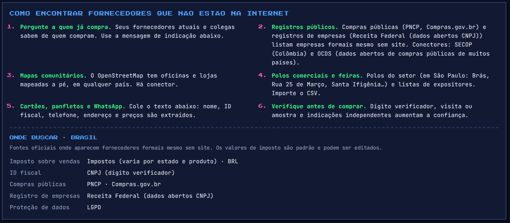

# Countries and languages

Supplier Scout was built in Colombia, but nothing in the logic is Colombian. A country is **one profile** in [`src/core/countries.js`](../src/core/countries.js): currency, default sales tax, the tax ID and its check digit, phone habits, regional weights, and where to look for formal suppliers. This page lists what each profile covers and what it does not.

**Interface languages:** Spanish, English, Portuguese and French: the web app, the explanations of every ranking, the quote and referral requests, and the agent (`--lang es|en|pt|fr`; by default, the country's language). The web app picks the browser's language and falls back to English.

## Coverage

All Spanish-speaking countries in Latin America, plus Brazil, Puerto Rico, Spain, Portugal, France and the US. Any other country uses the **generic profile**: prices, distances, reviews and duplicates work the same; tax-ID checks and local phone habits do not apply, and phone numbers must be written with their `+` code. Cuba uses the generic profile (`+53` numbers work when written in full).

| Country | Currency | Sales tax (default) | Tax ID | Check | Phone | Public procurement | Business registry | Data protection |
|---|---|---|---|---|---|---|---|---|
| Colombia (CO) | COP | IVA 19% | NIT | ✓ check digit | +57 | SECOP II | RUES | Ley 1581 de 2012 |
| Mexico (MX) | MXN | IVA 16% | RFC | format only | +52 | ComprasMX | SIEM | LFPDPPP |
| Guatemala (GT) | GTQ | IVA 12% | NIT | ✓ check digit | +502 | Guatecompras | Registro Mercantil, SAT | — |
| El Salvador (SV) | USD | IVA 13% | NIT | format only | +503 | COMPRASAL | CNR | — |
| Honduras (HN) | HNL | ISV 15% | RTN | format only | +504 | HonduCompras | Registro Mercantil | — |
| Nicaragua (NI) | NIO | IVA 15% | RUC | format only | +505 | SISCAE | Registro Público Mercantil | Ley 787 |
| Costa Rica (CR) | CRC | IVA 13% | Cédula jurídica | format only | +506 | SICOP | Registro Nacional | Ley 8968 |
| Panama (PA) | USD | ITBMS 7% | RUC | format only | +507 | PanamaCompra | Registro Público | Ley 81 de 2019 |
| Dominican Republic (DO) | DOP | ITBIS 18% | RNC | ✓ check digit | +1 | Portal Transaccional (DGCP) | DGII (consulta RNC) | Ley 172-13 |
| Venezuela (VE) | VES | IVA 16% | RIF | format only | +58 | RNC (Registro Nacional de Contratistas) | SENIAT (consulta RIF) | — |
| Ecuador (EC) | USD | IVA 15% | RUC | ✓ check digit | +593 | SERCOP (Compras Públicas) | SRI (consulta RUC), Superintendencia de Compañías | LOPDP |
| Peru (PE) | PEN | IGV 18% | RUC | ✓ check digit | +51 | SEACE, RNP | SUNAT (consulta RUC) | Ley 29733 |
| Bolivia (BO) | BOB | IVA 13% | NIT | format only | +591 | SICOES | SEPREC | — |
| Chile (CL) | CLP | IVA 19% | RUT | ✓ check digit | +56 | Mercado Público (ChileCompra) | SII, Registro de Empresas y Sociedades | Ley 19.628 |
| Argentina (AR) | ARS | IVA 21% | CUIT | ✓ check digit | +54 | COMPR.AR | ARCA (ex AFIP) | Ley 25.326 |
| Paraguay (PY) | PYG | IVA 10% | RUC | ✓ check digit | +595 | DNCP | DNIT (consulta RUC) | — |
| Uruguay (UY) | UYU | IVA 22% | RUT | ✓ check digit | +598 | ARCE, RUPE | DGI | Ley 18.331 |
| Puerto Rico (PR) | USD | IVU 11.5% | EIN | format only | +1 | — | Registro de Corporaciones | — |
| Brazil (BR) | BRL | Impostos (varies) | CNPJ | ✓ check digit | +55 | PNCP, Compras.gov.br | Receita Federal (dados abertos CNPJ) | LGPD |
| United States (US) | USD | Sales tax (varies) | EIN | format only | +1 | SAM.gov | OpenCorporates | — |
| Spain (ES) | EUR | IVA 21% | NIF | ✓ check digit | +34 | Plataforma de Contratación del Sector Público | Registro Mercantil | RGPD |
| Portugal (PT) | EUR | IVA 23% | NIF | ✓ check digit | +351 | Portal BASE | Registo Comercial | RGPD |
| France (FR) | EUR | TVA 20% | SIREN | ✓ check digit | +33 | BOAMP, PLACE | Annuaire des entreprises (SIRENE) | RGPD |

How to read it:

- **Sales tax** is the general rate, used only as an editable default to compare quotes. Reduced rates, exemptions and import duties are not modelled. Brazil and the US have no single rate: prices there are compared as quoted.
- **✓ check digit** means a mistyped tax ID is caught. Ecuador distinguishes companies, public bodies and people; the Dominican Republic accepts RNC (9 digits) and cédula (11); France accepts SIREN and SIRET; Spain accepts company NIFs, DNI and NIE; Brazil accepts the **alphanumeric CNPJ** issued from July 2026. **Format only** means there is no public check-digit rule, or I could not verify one well enough to rely on it: the ID is checked for shape and the app says so instead of claiming it is valid.
- **Data protection: —** means no general data-protection law is recorded in the profile, not that there are no rules. The app always asks for consent before storing a sole trader's details, whatever the country. Laws change: check the current one before relying on this column.
- **Public procurement and business registries** are the official places where formal suppliers appear even without a website. They are shown in the app (tab *Offline*) for the selected country.

## Getting suppliers out of those sources

| Source | How |
|---|---|
| Colombia, SECOP II | Built-in connector: `npm run scout -- registry --preset secop-co --q "..."` |
| Any Socrata open-data portal | `npm run scout -- registry --domain https://... --dataset xxxx-xxxx --country XX` |
| Any publisher of **OCDS** (Open Contracting Data Standard) | `npm run scout -- ocds --file releases.json --country PY` or `--url https://...`. Reads release packages, record packages and JSON Lines; imports the businesses that bid or won (never the contact person's name) and validates their tax ID with the country from the identifier scheme (`PY-RUC`, `MX-RFC`...) |
| Any registry that exports a spreadsheet | `npm run scout -- csv --file export.csv --country EC`. Columns are recognised by name in Spanish, English, Portuguese and French (*Razón social, RNC, Nome fantasia, CNPJ, Raison sociale, SIRET, Logradouro, Adresse...*) |
| Community maps | `npm run scout -- osm ...` works in every country |

Which countries publish OCDS, and where, changes over time; the [Open Contracting Partnership](https://www.open-contracting.org/) keeps the current list of publishers.

## Local habits the parser understands

What a business card, a flyer or a WhatsApp message looks like changes from one country to the next. These are covered by tests (`tests/capture.test.js`, `tests/countries.test.js`, `tests/quotes.test.js`):

- **Phones:** Argentina's `011 15-xxxx-xxxx` becomes `+54 9 11 ...` (and a `15` with no area code is refused rather than guessed); Mexico's old `044` / `045` / `01` prefixes and `+52 1`; Colombian landlines written before the 2021 change (`(1) 555 1234` is now `601 555 1234`); Brazilian long-distance carrier codes (`0 21 11 ...`); the North American plan in the Dominican Republic and Puerto Rico.
- **Money:** `$`, `RD$`, `Q`, `₡`, `Gs.`, `₲`, `S/`, `$U`, `C$`, `B/.`, `R$`, `€`, words (*soles, quetzales, lempiras, reais, euros*) and slang (*lucas*, *palos*). `Bs` can be the Venezuelan bolívar or the Bolivian boliviano: it is local in those two countries and flagged for confirmation anywhere else.
- **Tax wording:** *más IVA, + IGV, con ITBIS, ITBMS incluido, com impostos, HT / TTC*.
- **Units:** *arroba, quintal* and *libra* use each country's traditional value (an arroba is 12.5 kg in Colombia and 15 kg in Brazil; a Colombian *libra* is 500 g) and always ask for confirmation; *docena, dúzia, douzaine, ciento, millar, milheiro, cuñete, yarda*; packs written `c/100`, `caixa c/ 100`, `boîte de 100`.
- **Addresses:** Colombian `Cra 68 # 13-80`, Brazilian `Rua ..., 120`, French `12 rue ...`, and Central American directions by landmark (*del colmado 200 metros al norte*, *100 varas al sur*).
- **Words for trades:** *tlapalería, pijas, gasfitería, corralón, colmado, pulpería, ferragens, parafusos, quincaillerie...* map to the same categories.

## Adding a country

Add one `profile(...)` entry in `src/core/countries.js` with its currency, tax, tax-ID labels and validator, calling code and national number lengths. If the tax ID has a published check digit, add the validator and a test with a **fictional** number that passes and one that fails. Nothing else in the code needs to change. The test `every country profile is complete and consistent` checks the rest.

## What is not covered

- Check digits for Mexico's RFC homoclave, Venezuela's RIF, Bolivia's NIT and the Central American IDs marked *format only* above.
- Sub-national taxes (Brazil's ICMS by state, US sales tax by state and city), withholding taxes, and import duties.
- Right-to-left languages and non-Latin scripts: the interface and the parser assume Latin script.
